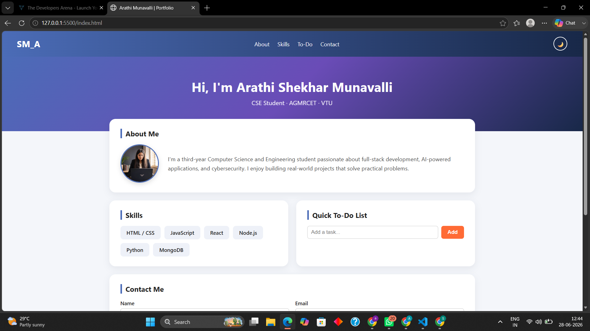
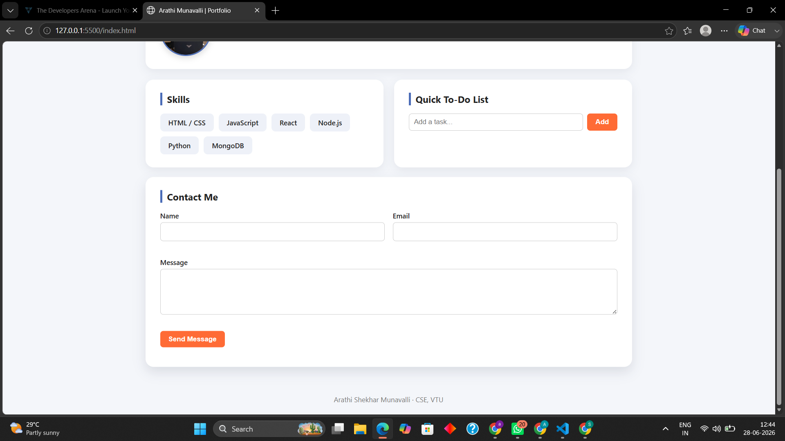

# 🌐 Personal Portfolio Website

## 📌 Project Overview

This is a personal portfolio website developed using **HTML5, CSS3, and JavaScript**.

The website showcases my profile, technical skills, and contact information with a clean and responsive user interface.

In Week 3, the project was enhanced by adding **JavaScript interactivity**, an interactive To-Do List, theme toggle functionality, and improved responsive design.

---

## ✨ Features

- 👩‍💻 About Me section with profile image and introduction
- 🛠️ Skills section displaying technical skills
- ✅ Interactive To-Do List using JavaScript
- ➕ Add tasks dynamically using user input
- 🌙 Dark/Light theme toggle
- 📌 Navigation menu with anchor links
- 🎨 Gradient header design
- 📦 Card-style layout with shadows and rounded corners
- ✨ Hover effects on buttons and navigation links
- 📱 Responsive design for different screen sizes
- 📩 Contact form with Name, Email, and Message fields
- Footer with copyright information

---

## 🛠️ Technologies Used

- HTML5
- CSS3
- JavaScript

---

## 📂 Project Structure

```
week3_Portfolio/
│
├── index.html
├── style.css
├── script.js
├── README.md
│
├── images/
│   └── profile.jpg
│
├── about.png
├── todo.png
│
└── ARATHI S M.pdf
```

---

## 🚀 How to Run

1. Clone the repository

```bash
git clone https://github.com/arathism/week3_Portfolio.git
```

2. Open the project folder.

3. Run `index.html` in any browser.

---

## 📸 Screenshots

### About Section, Skills Section and Home Page




### To-Do List, Contact Form and Footer Section



---

## 💻 JavaScript Concepts Used

- DOM Manipulation
- Event Handling
- Button Click Events
- User Input Handling
- Dynamic Content Updates
- Interactive webpage elements

---

## 🎨 CSS Concepts Used

- Flexbox Layout
- Responsive Design using Media Queries
- Gradient Backgrounds
- Box Shadow
- Border Radius
- Hover Effects
- Margin and Padding

---

## 📚 Learning Outcomes

- Learned to create responsive web pages
- Improved HTML structure and CSS styling skills
- Implemented JavaScript functionality
- Understood DOM manipulation and events
- Built interactive user interface components

---

## 📄 Documentation

Complete project documentation including project overview, implementation details, screenshots, and learning outcomes is available in:

**ARATHI S M.pdf**

---

## 👩‍💻 Author

**Arathi S M**

Computer Science Engineering Student  
VTU

© 2026 Arathi S M. All Rights Reserved.
